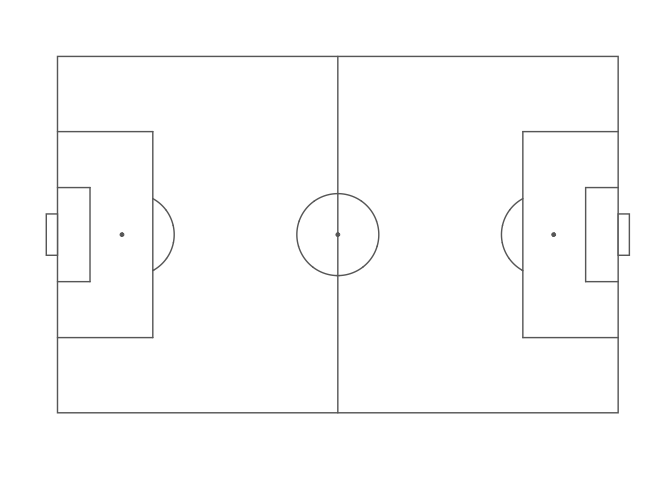
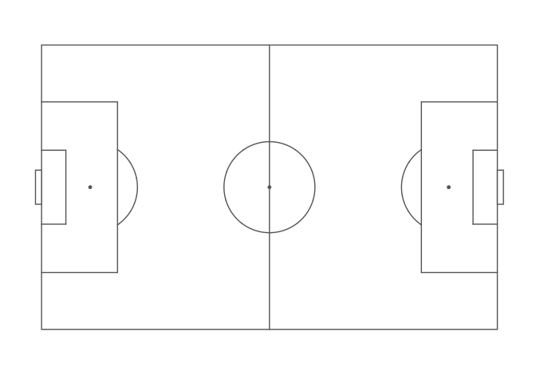

<!-- README.md is generated from README.Rmd. Please edit that file -->

# ggsoccer 

[](https://cran.r-project.org/package=ggsoccer)
[](https://cran.r-project.org/package=ggsoccer)
[](https://www.tidyverse.org/lifecycle/#experimental)
[](https://travis-ci.org/Torvaney/ggsoccer)

## Overview

ggsoccer provides a handful of functions that make it easy to plot
soccer event data in R/ggplot2.

## Installation

ggsoccer is available via CRAN:

``` r
install.packages("ggsoccer")
```

Alternatively, you can download the development version from github like
so:

``` r
# install.packages("remotes")
remotes::install_github("torvaney/ggsoccer")
```

## Usage

``` r
library(ggplot2)
library(ggsoccer)

ggplot() +
  annotate_pitch() +
  theme_pitch()
```

<!-- -->

The following example uses ggsoccer to solve a realistic problem:
plotting a set of passes onto a soccer pitch.

``` r
library(ggplot2)
library(ggsoccer)

pass_data <- data.frame(x = c(24, 18, 64, 78, 53),
                        y = c(43, 55, 88, 18, 44),
                        x2 = c(34, 44, 81, 85, 64),
                        y2 = c(40, 62, 89, 44, 28))

ggplot(pass_data) +
  annotate_pitch() +
  geom_segment(aes(x = x, y = y, xend = x2, yend = y2),
               arrow = arrow(length = unit(0.25, "cm"),
                             type = "closed")) +
  theme_pitch() +
  direction_label() +
  ggtitle("Simple passmap", 
          "ggsoccer example")
```

<!-- -->

Because ggsoccer is implemented as ggplot layers, it makes customising a
plot very easy. Here is a different example, plotting shots on a
**green** pitch.

Note that by default, ggsoccer will display the whole pitch. To display
a subsection of the pitch, simply set the plot limits as you would with
any other ggplot2 plot. Here, we use the `xlim` and `ylim` arguments to
`coord_flip`.

Because of the way coordinates get flipped, we must also reverse the
y-axis to ensure that the orientation remains correct.

NOTE: Ordinarily, we would just do this with `scale_y_reverse`. However,
due to a [bug in
ggplot2](https://github.com/tidyverse/ggplot2/issues/3120), this results
in certain elements of the pitch (center and penalty box arcs) failing
to render. Instead, we can flip the y coordinates manually (`100 - y` in
this case).

``` r

shots <- data.frame(x = c(90, 85, 82, 78, 83, 74, 94, 91),
                    y = c(43, 40, 52, 56, 44, 71, 60, 54))

ggplot(shots) +
  annotate_pitch(colour = "white",
                 fill   = "chartreuse4",
                 limits = FALSE) +
  geom_point(aes(x = x, y = 100 - y),
             colour = "yellow", 
             size = 4) +
  theme_pitch() +
  theme(plot.background = element_rect(fill = "chartreuse4"),
        title = element_text(colour = "white")) +
  coord_flip(xlim = c(49, 101),
             ylim = c(-1, 101)) +
  ggtitle("Simple shotmap",
          "ggsoccer example")
```

<!-- -->

### Data providers

ggsoccer defaults to Opta’s 100x100 coordinate system. However,
different data providers may use alternative coordinates.

ggsoccer provides support for a few data providers out of the box, as
well as an interface for any custom coordinate system:

  - Opta
  - Statsbomb
  - Wyscout

#### Statsbomb

``` r
# ggsoccer enables you to rescale coordinates from one data provider to another, too
to_statsbomb <- rescale_coordinates(from = pitch_opta, to = pitch_statsbomb)

passes_rescaled <- data.frame(x  = to_statsbomb$x(pass_data$x),
                              y  = to_statsbomb$y(pass_data$y),
                              x2 = to_statsbomb$x(pass_data$x2),
                              y2 = to_statsbomb$y(pass_data$y2))

ggplot(passes_rescaled) +
  annotate_pitch(dimensions = pitch_statsbomb) +
  geom_segment(aes(x = x, y = y, xend = x2, yend = y2),
               colour = "firebrick",
               arrow = arrow(length = unit(0.25, "cm"),
                             type = "closed")) +
  theme_pitch() +
  direction_label(x_label = 60) +
  ggtitle("Simple passmap", 
          "Statsbomb co-ordinates")
```

<!-- -->

#### Custom data

To plot data for a dataset not provided, ggsoccer just requires a pitch
specification. This is a list containing the required pitch dimensions
like so:

``` r
pitch_custom <- list(
  length = 150,
  width = 100,
  penalty_box_length = 25,
  penalty_box_width = 50,
  six_yard_box_length = 8,
  six_yard_box_width = 26,
  penalty_spot_distance = 16,
  goal_width = 12,
  origin_x = 0,
  origin_y = 0
)

ggplot() +
  annotate_pitch(dimensions = pitch_custom) +
  theme_pitch()
```

<!-- -->

## Other options

There are other packages that offer alternative pitch plotting options.
Depending on your use case, you may want to check these out too:

  - [soccermatics](https://github.com/JoGall/soccermatics)
  - [SBpitch](https://github.com/FCrSTATS/SBpitch)
  - [fc.rstats](https://github.com/FCrSTATS/fc.rstats)
