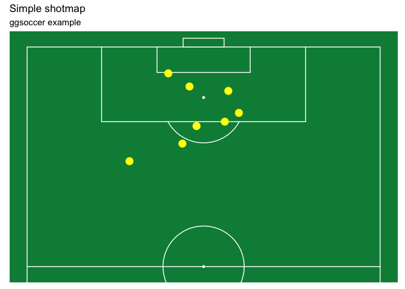

<!-- README.md is generated from README.Rmd. Please edit that file -->

# ggsoccer 

## Overview

ggsoccer provides a handful of functions to make it easy to plot
Opta-style soccer event data in R/ggplot2.

## Installation

ggsoccer is not currently available on CRAN and must be downloaded from
github like so:

``` r
# install.packages("devtools")
devtools::install_github("torvaney/ggsoccer")
```

## Usage

The following example uses ggsoccer to solve a fairly realistic problem:
plot a set of passes onto a soccer pitch.

``` r
library(ggplot2)
library(ggsoccer)

pass_data <- data.frame(x = c(24, 18, 64, 78, 53),
                        y = c(43, 55, 88, 18, 44),
                        x2 = c(34, 44, 81, 85, 64),
                        y2 = c(40, 62, 89, 44, 28))

ggplot(pass_data) +
  annotate_pitch() +
  geom_segment(aes(x = x, y = y, xend = x2, yend = y2),
               arrow = arrow(length = unit(0.25, "cm"),
                             type = "closed")) +
  theme_pitch() +
  direction_label() +
  ggtitle("Simple passmap", 
          "ggsoccer example")
```

<!-- -->

Because ggsoccer is implemented as ggplot layers, it makes customising a
plot very easy. Here is a different example, plotting shots on a
**gray** pitch.

Note that by default, ggsoccer will display the whole pitch. To display
a subsection of the pitch, simply set the plot limits as you would with
any other ggplot2 plot. Here, we use the `xlim` and `ylim` arguments to
`coord_flip`:

``` r

shots <- data.frame(x = c(90, 85, 82, 78, 83, 74),
                    y = c(43, 40, 52, 56, 44, 71))

ggplot(shots) +
  annotate_pitch(colour = "gray70",
                 fill = "gray90") +
  geom_point(aes(x = x, y = y),
             fill = "white", 
             size = 4, 
             pch = 21) +
  theme_pitch() +
  coord_flip(xlim = c(49, 101),
             ylim = c(-1, 101)) +
  ggtitle("Simple shotmap",
          "ggsoccer example")
```

<!-- -->

### StatsBomb data

Finally, different data providers may use alternative co-ordinate
systems to ggsoccer’s default 100x100. For instance, [StatsBomb’s
release of free data]() uses a 120x80 co-ordinate system. This can be
easily handled with the `*_scale` arguments to `annotate_pitch`:

``` r
# Rescale shots to use StatsBomb-style coordinates
shots_rescaled <- data.frame(x = shots$x * 1.20,
                             y = shots$y * 0.80)

ggplot(shots_rescaled) +
  annotate_pitch(x_scale = 1.2,
                 y_scale = 0.8,
                 colour = "gray70",
                 fill = "gray90") +
  geom_point(aes(x = x, y = y),
             fill = "white", 
             size = 4, 
             pch = 21) +
  theme_pitch() +
  coord_flip(xlim = c(59, 121),
             ylim = c(-1, 81)) +
  ggtitle("Simple shotmap",
          "ggsoccer example (120x80 co-ordinates)")
#> Warning: Removed 1 rows containing missing values (geom_point).
#> Warning: Removed 2 rows containing missing values (geom_point).
```

<!-- -->

## Other options

There are other packages that offer alternative pitch plotting options.
Depending on your use case, you may want to check these out too:

  - [soccermatics](https://github.com/JoGall/soccermatics)
  - [SBpitch](https://github.com/FCrSTATS/SBpitch)
