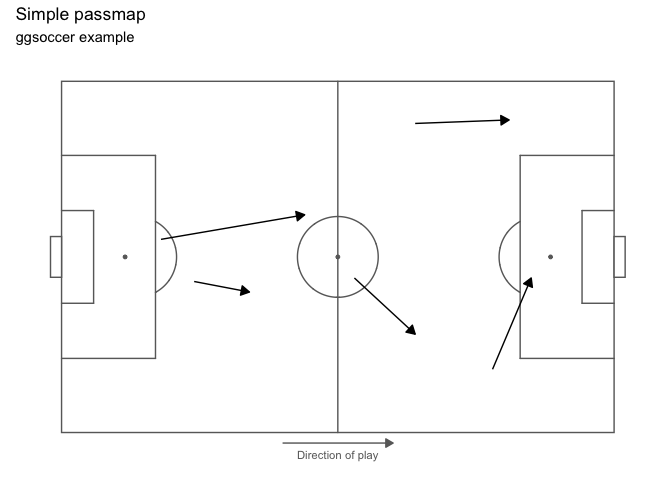
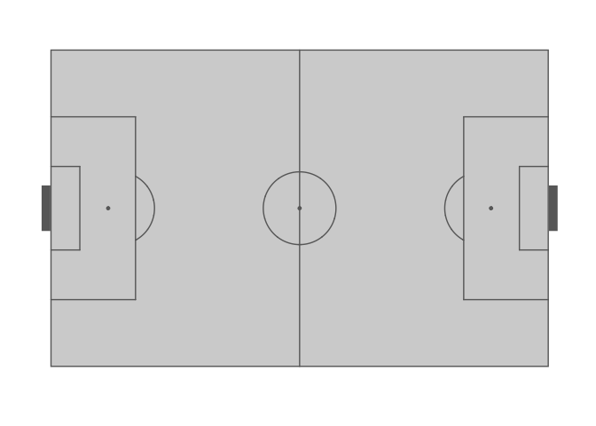

<!-- README.md is generated from README.Rmd. Please edit that file -->

# ggsoccer 

<!-- badges: start -->

[](https://cran.r-project.org/package=ggsoccer)
[](https://cran.r-project.org/package=ggsoccer)
[](https://lifecycle.r-lib.org/articles/stages.html#stable)
[](https://github.com/Torvaney/ggsoccer/actions)
<!-- badges: end -->

## Overview

ggsoccer provides a functions for plotting soccer event data in
R/ggplot2.

## Installation

ggsoccer is available via CRAN:

``` r
install.packages("ggsoccer")
```

Alternatively, you can download the development version from github like
so:

``` r
# install.packages("remotes")
remotes::install_github("torvaney/ggsoccer")
```

## Usage

``` r
library(ggplot2)
library(ggsoccer)

ggplot() +
  annotate_pitch() +
  theme_pitch()
```

<!-- -->

The following example uses ggsoccer to solve a realistic problem:
plotting a set of passes onto a soccer pitch.

``` r
pass_data <- data.frame(x = c(24, 18, 64, 78, 53),
                        y = c(43, 55, 88, 18, 44),
                        x2 = c(34, 44, 81, 85, 64),
                        y2 = c(40, 62, 89, 44, 28))

ggplot(pass_data) +
  annotate_pitch() +
  geom_segment(aes(x = x, y = y, xend = x2, yend = y2),
               arrow = arrow(length = unit(0.25, "cm"),
                             type = "closed")) +
  theme_pitch() +
  direction_label() +
  ggtitle("Simple passmap", 
          "ggsoccer example")
```

<!-- -->

Because ggsoccer is implemented as ggplot layers, plots can be
customised with standard ggplot functions and layers.

Here is a different example, plotting shots on a **green** pitch.

By default, ggsoccer will display the whole pitch. To display a
subsection of the pitch, set the plot limits as you would with any other
ggplot2 plot. Here, we use the `xlim` and `ylim` arguments to
`coord_flip`.

`coord_flip` reverses the orientation of the points, so we must also
reverse the y-axis to ensure that the orientation remains correct (that
is, shots from the left hand side appear on the left, and right-sided
shots appear on the right).

You can do this with either `scale_y_reverse` or by reversing the order
of the limits in `coord_flip`’s `ylim` argument.

If you don’t correct (i.e. reverse) the y axis orientation, the penalty
box arcs will appear inside the box!

``` r
shots <- data.frame(x = c(90, 85, 82, 78, 83, 74, 94, 91),
                    y = c(43, 40, 52, 56, 44, 71, 60, 54))

ggplot(shots) +
  annotate_pitch(colour = "white",
                 fill   = "springgreen4",
                 limits = FALSE) +
  geom_point(aes(x = x, y = y),
             colour = "yellow",
             size = 4) +
  theme_pitch() +
  theme(panel.background = element_rect(fill = "springgreen4")) +
  coord_flip(xlim = c(49, 101)) +
  scale_y_reverse() +
  ggtitle("Simple shotmap",
          "ggsoccer example")
```

<!-- -->

### Data providers

ggsoccer defaults to Opta’s 100x100 coordinate system. However,
different data providers may use alternative coordinates.

ggsoccer provides support for a few data providers out of the box:

- StatsPerform/Opta (`pitch_statsperform`, default)
- Statsbomb (`pitch_statsbomb`)
- Wyscout (`pitch_wyscout`)
- Tracab (`make_pitch_tracab()`)

ggsoccer also provides an interface for any custom coordinate system.

#### Statsbomb

``` r
# ggsoccer enables you to rescale coordinates from one data provider to another, too
to_statsbomb <- rescale_coordinates(from = pitch_opta, to = pitch_statsbomb)

passes_rescaled <- data.frame(x  = to_statsbomb$x(pass_data$x),
                              y  = to_statsbomb$y(pass_data$y),
                              x2 = to_statsbomb$x(pass_data$x2),
                              y2 = to_statsbomb$y(pass_data$y2))

ggplot(passes_rescaled) +
  annotate_pitch(dimensions = pitch_statsbomb) +
  geom_segment(aes(x = x, y = y, xend = x2, yend = y2),
               colour = "coral",
               arrow = arrow(length = unit(0.25, "cm"),
                             type = "closed")) +
  theme_pitch() +
  direction_label(x_label = 60) +
  ggtitle("Simple passmap", 
          "Statsbomb co-ordinates")
```

<!-- -->

#### Custom data

To plot data for a dataset not provided, ggsoccer requires a pitch
specification. This is a list containing the required pitch dimensions
like so:

``` r
pitch_custom <- list(
  length = 150,
  width = 100,
  penalty_box_length = 25,
  penalty_box_width = 60,
  six_yard_box_length = 8,
  six_yard_box_width = 26,
  penalty_spot_distance = 16,
  goal_width = 12,
  origin_x = -50,
  origin_y = -75
)

ggplot() +
  annotate_pitch(dimensions = pitch_custom) +
  theme_pitch()
```

<!-- -->

### Goals

ggsoccer allows you to customise your goals markings by supplying a
function to the `goals` argument of `annotate_pitch`:

``` r
ggplot() +
  annotate_pitch(fill = "steelblue4", colour = "white", goals = goals_line) +
  theme_pitch() +
  theme(panel.background = element_rect(fill = "steelblue4"))
```

<!-- -->

``` r
ggplot() +
  annotate_pitch(goals = goals_strip, fill = "lightgray") +
  theme_pitch()
```

<!-- -->

This argument takes a function (or one-sided formula). You can use the
supplied functions, or create your own goal markings function. The
`goals` argument also supports using one-sided formulas as lambda
functions (see
[`rlang::as_function`](https://rlang.r-lib.org/reference/as_function.html)).

Custom goals functions must accept the arguments used by
`annotate_pitch`: `colour`, `fill`, `dimensions`, `linewidth`, `alpha`,
and `linetype`. Additional arguments can also be added.

``` r
goals_custom <- function(colour, fill, dimensions, ...) {
  goals_strip(colour, fill, dimensions, lineend = "square", linewidth = 3.5)
}

ggplot() +
  annotate_pitch(
    goals = goals_custom, 
    fill = "lightgray"
  ) +
  theme_pitch()
```

<!-- -->

See `help(goals_box)` for the full list of available functions.

The idea for having multiple goal markings was taken and adapted from
the [fc.rstats](https://github.com/FCrSTATS/fc.rstats) package.

### Further customisation

You can also alter the style of pitch markings with `linewidth`,
`alpha`, and `linetype`:

``` r
ggplot() +
  annotate_pitch(
    colour = "white", 
    linewidth = 1.5, 
    linetype = "12", 
    alpha = 0.2, 
    goals = goals_line
  ) +
  theme_pitch() +
  theme(panel.background = element_rect(fill = "steelblue"))
```

<!-- -->

## Other options

There are other packages that offer alternative pitch plotting options.
Depending on your use case, you may want to check these out too:

- [soccermatics](https://github.com/JoGall/soccermatics)
- [SBpitch](https://github.com/FCrSTATS/SBpitch)
- [fc.rstats](https://github.com/FCrSTATS/fc.rstats)
- [sportyR](https://github.com/sportsdataverse/sportyR)

### Python

There are a couple of pitch plotting options for matplotlib, too:

- [mplsoccer](https://github.com/andrewRowlinson/mplsoccer)
- [matplotsoccer](https://github.com/TomDecroos/matplotsoccer)
